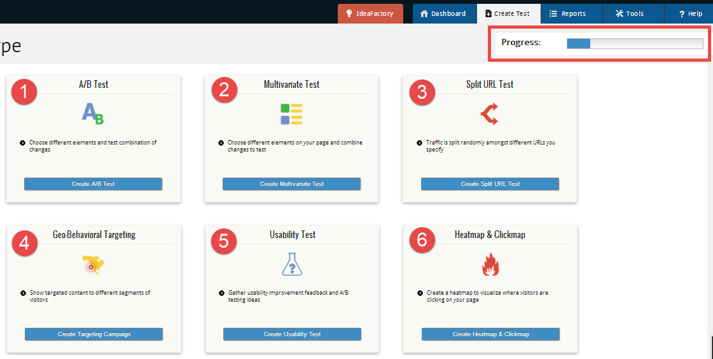

## Concept image to functional page demonstration

This is a relatively straight forward demonstration of taking an image of
webpage (in this case a .png) and creating a functional webpage with it using
HTML/CSS/Javascript.  In this case the [bootstrap](http://www.getbootstrap.com)
framework was used to get the sizing of the columns correct as and to import the
bootstrap glyphicons.

The original image looks like this:

_The tabs, progress bar, buttons, and pretty much everything else was hand
coded._

There's little value in this aside from this serving as a portfolio piece. See it in action [here](https://sethborden.github.io/wireframes)

##### Original image is from [here](https://www.ventureharbour.com/wp-content/uploads/2014/05/VWO-List-of-Tests.png)
